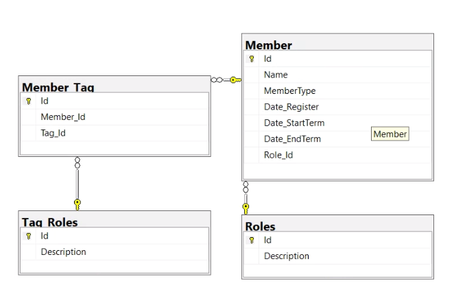

# Member Management 
This project is a member management where we can add two types of member: 1 - Employee and 2 - Contractor, for each one, it has a determining attribute like Roles and Tags. It is a ASP.NET Core MVC Application but with some differences from patterns. I created other projects in the solution to organize the Business and Services Layers.

## Technologies used in this project

### [C#](https://docs.microsoft.com/en-us/dotnet/csharp/)

C# is an elegant and type-safe object-oriented language that enables developers to build a variety of secure and robust applications that run on the .NET Framework. You can use C# to create Windows client applications, XML Web services, distributed components, client-server applications, database applications, and much, much more. 

### [ASPNET Core MVC Framework](https://docs.microsoft.com/en-us/aspnet/core/tutorials/first-mvc-app/start-mvc?view=aspnetcore-3.0&tabs=visual-studio)

ASP.NET Core MVC is a rich framework for building web apps and APIs using the Model-View-Controller design pattern.

### [.Net Core 3.0](https://docs.microsoft.com/en-us/dotnet/core/tutorials/with-visual-studio-code)
.NET Core is an open-source, general-purpose development platform maintained by Microsoft and the .NET community on GitHub. It's cross-platform (supporting Windows, macOS, and Linux) and can be used to build device, cloud, and IoT applications.

### [SQLServer](https://www.sqlservertutorial.net/)

SQL Server is a relational database management system, or RDBMS, developed and marketed by Microsoft.

### [HTML, CSS, Javascript](https://html-css-js.com/)

HTML, CSS, Javascript are the fundamental technologies for web development

### [jQuery](http://jquery.com)

jQuery is a fast, small, and feature-rich JavaScript library. It makes things like HTML document traversal and manipulation, event handling, animation, and Ajax much simpler with an easy-to-use API that works across a multitude of browsers.

## Pre-Requisites

Tools used to desenv this application, you must install the following tools:

#### [Microsoft Visual Studio - Community](https://visualstudio.microsoft.com/pt-br/vs/community/?rr=https%3A%2F%2Fwww.google.com%2F)
At installation, you can load the necessary technologies for this project, therefore:

In tab WorkLoads select the options:
* ASP.NET and web development
* Data storage and processing

In tab Individual Components, leave those selected and make sure that the following components are selected:
* ASP.NET MVC 4
* .Net Core 3.0 Runtime
* SQL Server Integration Services Projects

#### [SQLServer](https://www.microsoft.com/pt-br/sql-server/sql-server-downloads)

Use this tool to configure your Database Server, you can use the [documentation](https://docs.microsoft.com/en-us/sql/database-engine/configure-windows/scm-services-configure-server-startup-options?view=sql-server-2017) to help.

#### [SSMS - SQL SERVER MANAGEMENT STUDIO](https://docs.microsoft.com/en-us/sql/ssms/download-sql-server-management-studio-ssms?view=sql-server-ver15)

This tool was used to create the [database](https://docs.microsoft.com/en-us/sql/relational-databases/databases/databases?view=sql-server-2017) using an easy interface


If necessary here is the SQL Script and Diagram
<details>
  <summary>Scripts Database and Diagram</summary>
  
  

  ## Script Tables
  ```
    USE [**DATABASE_NAME**]
    GO

    /****** Object:  Table [dbo].[Member]    Script Date: 2/14/2020 10:29:20 AM ******/
    SET ANSI_NULLS ON
    GO

    SET QUOTED_IDENTIFIER ON
    GO
    
    CREATE TABLE [dbo].[Member](
    	[Id] [int] IDENTITY(1,1) NOT NULL,
    	[Name] [varchar](500) NOT NULL,
    	[MemberType] [int] NOT NULL,
    	[Date_Register] [datetime] NOT NULL,
    	[Date_StartTerm] [datetime] NULL,
    	[Date_EndTerm] [datetime] NULL,
    	[Role_Id] [int] NULL,
     CONSTRAINT [PK_Member] PRIMARY KEY CLUSTERED 
    (
    	[Id] ASC
    )WITH (PAD_INDEX = OFF, STATISTICS_NORECOMPUTE = OFF, IGNORE_DUP_KEY = OFF, ALLOW_ROW_LOCKS = ON, ALLOW_PAGE_LOCKS = ON) ON [PRIMARY]
    ) ON [PRIMARY]
    GO
        /****** Object:  Table [dbo].[Tag_Roles]    Script Date: 2/14/2020 10:29:20 AM ******/
    CREATE TABLE [dbo].[Tag_Roles](
    	[Id] [int] IDENTITY(1,1) NOT NULL,
    	[Description] [varchar](200) NOT NULL,
     CONSTRAINT [PK_Tag_Roles] PRIMARY KEY CLUSTERED 
    (
    	[Id] ASC
    )WITH (PAD_INDEX = OFF, STATISTICS_NORECOMPUTE = OFF, IGNORE_DUP_KEY = OFF, ALLOW_ROW_LOCKS = ON, ALLOW_PAGE_LOCKS = ON) ON [PRIMARY]
    ) ON [PRIMARY]
    GO
    /****** Object:  Table [dbo].[Roles]    Script Date: 2/14/2020 10:29:20 AM ******/
            CREATE TABLE [dbo].[Roles](
        	[Id] [int] IDENTITY(1,1) NOT NULL,
        	[Description] [varchar](200) NOT NULL,
         CONSTRAINT [PK_Roles] PRIMARY KEY CLUSTERED 
        (
        	[Id] ASC
        )WITH (PAD_INDEX = OFF, STATISTICS_NORECOMPUTE = OFF, IGNORE_DUP_KEY = OFF, ALLOW_ROW_LOCKS = ON, ALLOW_PAGE_LOCKS = ON) ON [PRIMARY]
        ) ON [PRIMARY]
        /****** Object:  Table [dbo].[Member_Tag]    Script Date: 2/14/2020 10:29:20 AM ******/
      CREATE TABLE [dbo].[Member_Tag](
    	[Id] [int] IDENTITY(1,1) NOT NULL,
    	[Member_Id] [int] NOT NULL,
    	[Tag_Id] [int] NOT NULL,
         CONSTRAINT [PK_Member_Tag] PRIMARY KEY CLUSTERED 
        (
        	[Id] ASC
        )WITH (PAD_INDEX = OFF, STATISTICS_NORECOMPUTE = OFF, IGNORE_DUP_KEY = OFF, ALLOW_ROW_LOCKS = ON, ALLOW_PAGE_LOCKS = ON) ON [PRIMARY]
        ) ON [PRIMARY]
        GO
  ```
  ## Script Foreign Keys
  
    ALTER TABLE [dbo].[Member]  WITH NOCHECK ADD  CONSTRAINT [FK_Member_Roles] FOREIGN KEY([Role_Id])
    REFERENCES [dbo].[Roles] ([Id])
    NOT FOR REPLICATION 
    GO
    
    ALTER TABLE [dbo].[Member] NOCHECK CONSTRAINT [FK_Member_Roles]
    GO
    
    EXEC sys.sp_addextendedproperty @name=N'MS_Description', @value=N'Member Id' , @level0type=N'SCHEMA',@level0name=N'dbo', @level1type=N'TABLE',@level1name=N'Member', @level2type=N'COLUMN',@level2name=N'Id'
    GO
    
    EXEC sys.sp_addextendedproperty @name=N'MS_Description', @value=N'Member Name' , @level0type=N'SCHEMA',@level0name=N'dbo', @level1type=N'TABLE',@level1name=N'Member', @level2type=N'COLUMN',@level2name=N'Name'
    GO
    
    EXEC sys.sp_addextendedproperty @name=N'MS_Description', @value=N'Type of Member: 1 - Employee and 2 - Contractor' , @level0type=N'SCHEMA',@level0name=N'dbo', @level1type=N'TABLE',@level1name=N'Member', @level2type=N'COLUMN',@level2name=N'MemberType'
    GO
    
    EXEC sys.sp_addextendedproperty @name=N'MS_Description', @value=N'Foreign key Roles' , @level0type=N'SCHEMA',@level0name=N'dbo', @level1type=N'TABLE',@level1name=N'Member', @level2type=N'CONSTRAINT',@level2name=N'FK_Member_Roles'
    GO
    
    ALTER TABLE [dbo].[Member_Tag]  WITH NOCHECK ADD  CONSTRAINT [FK_Member_Tag_Member] FOREIGN KEY([Member_Id])
    REFERENCES [dbo].[Member] ([Id])
    NOT FOR REPLICATION 
    GO
    
    ALTER TABLE [dbo].[Member_Tag] CHECK CONSTRAINT [FK_Member_Tag_Member]
    GO
    
    ALTER TABLE [dbo].[Member_Tag]  WITH NOCHECK ADD  CONSTRAINT [FK_Member_Tag_Tag_Roles] FOREIGN KEY([Tag_Id])
    REFERENCES [dbo].[Tag_Roles] ([Id])
    NOT FOR REPLICATION 
    GO
    
    ALTER TABLE [dbo].[Member_Tag] CHECK CONSTRAINT [FK_Member_Tag_Tag_Roles]
    GO

</details>


* Clone this repository:
  ```
  $ git clone https://gitlab.com/rheniery/ManagementApp
  ```
* Follow the tutorial to install the packages mentioned above.

## How to run this application

Completed the Prerequisite steps

Open in the base path the solution's project: **ManagementApp.sln**

Change the return of the `GetConnectionString()` method in **StandardConnection.cs** file within `Management.Services\StandardService` to configure your server and database.

Check that all dependencies are correct:
* In Solution Explorer, choose or open the solution.
* On the menu bar, choose Build, and then Build Solution to compile only those project files and components that have changed since the most recent build.

Right-click the ManagementAppplication project and Set as StartUp Project

Then, now you can Run the application.

